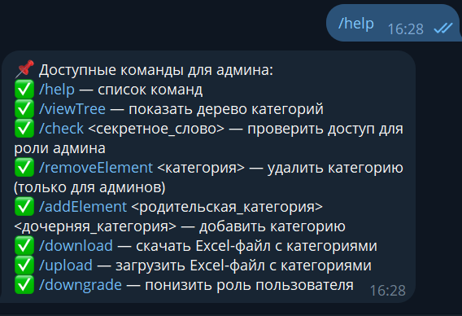

# Telegram-бот для управления деревом категорий

[](https://opensource.org/licenses/MIT)

---

## Описание

Этот проект представляет собой **Telegram-бота**, который позволяет пользователям создавать, просматривать и удалять дерево категорий. Бот реализован с использованием **Spring Boot** и **PostgreSQL**, а для взаимодействия с Telegram API применяется библиотека **TelegramBots**.

---

## Функционал

- **Просмотр дерева категорий:**  
  `/viewTree`

- **Добавление элемента:**

  - **Корневого элемента:**  
    `/addElement <название элемента>`
  - **Дочернего элемента:**  
    `/addElement <родительский элемент> <дочерний элемент>`

- **Удаление элемента (вместе с дочерними):**  
  `/removeElement <название элемента>`

- **Просмотр списка команд:**  
  `/help`

> **Дополнительные (необязательные) команды:**
>
> - **Скачивание дерева в Excel:** `/download`
> - **Загрузка дерева из Excel:** `/upload`
> - **Админ Панель:** `/check <password>`

---

## Технологии

- **Backend:** Spring Boot
- **База данных:** PostgreSQL (Spring Data JPA)
- **Telegram API:** TelegramBots
- **Контейнеризация:** Docker
- **Архитектура:** Command pattern, SOLID
- **Тестирование:** Unit Tests (JUnit)

---

## Процесс Работы
/start


/check 


/viewTree


/addElement


/removeElement


/help


## TelegramBots

# TelegramBot

telegram.bot-token:${TELEGRAM_BOT_TOKEN:7852665315:AAEOAXvEuLHMDxQR9hFwHHbHmtTnluAj81A}
telegram.bot-username:${TELEGRAM_BOT_USERNAME:Pandev_Tech-Task_bot}
security.admin-secret:${ADMIN_SECRET:1234}

Если вы хотите стать адмиином то введите /check 1234

### Локальный запуск

1. **Клонирование репозитория:**

   ```bash
   git clone https://github.com/Yersdev/Pandev_Tech_Task.git
   cd Pandev_Tech_Task
   ```

2. **Настроить базу данных в `application.properties`:**

   ```
   spring.application.name=Pandev_Tech_Task

   # JPA/Hibernate Properties
   spring.jpa.hibernate.ddl-auto=update
   spring.jpa.show-sql=true
   spring.jpa.properties.hibernate.format_sql=true
   spring.datasource.url=${DB_URL:jdbc:postgresql://db:5432/mydatabase}
   spring.datasource.username=${DB_USERNAME:postgres}
   spring.datasource.password=${DB_PASSWORD:12345678}
   spring.jpa.properties.hibernate.dialect=org.hibernate.dialect.PostgreSQLDialect

   ```

3. **Запустить проект:**
   ```bash
   docker compose up --build
   ```

---

## Докеризация

1. **Собрать Docker-образ:**
   ```bash
   docker compose up --build
   ```

### CI/CD (если реализовано)

Если проект поддерживает CI/CD, можно настроить автоматический деплой через GitHub Actions или GitLab CI/CD, добавив соответствующие `.yml` файлы в корень репозитория.

---

## Контакты

Если у вас есть вопросы, обращайтесь по почте: [yersultanamangedlindev@gmail.com](yersultanamangedlindev@gmail.com)
